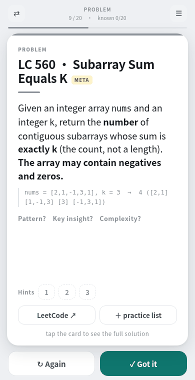

# GrindCards

**Coding-interview flashcards you build with your agent — from the problems you got wrong.**

[](https://pypi.org/project/grindcards/)
[](https://github.com/SitianLu/grindcards/actions/workflows/ci.yml)
[](LICENSE)

You fail a problem. You tell Claude (or any agent with the skill) *where* it broke. It asks
you three questions and writes a card in your own deck: which pattern and why, the reasoning
in first person — with your dead-end kept in — the full code, and the two or three lines you
want to remember next time. `grindcards build` executes every card's code, then turns the
deck into a single-file app that works offline on your phone.

<p align="center"></p>

## Why not Anki + an editorial?

Because a card that restates the editorial is a card you forget. What you remember is
*your* wrong turn and *your* one-line fix, and no deck someone else wrote has those. So the
tool is built around getting them out of you before a card is written — and around a few
quality rules that the build actually enforces:

- **Every solution runs.** `verify` executes each card's code against its own test, in every
  language of the deck. A card whose code doesn't run doesn't build.
- **Reasoning, not narration.** The idea section is written as thinking aloud at a whiteboard
  — first person, present tense, dead-ends included — and the spec forbids the
  "**Brute force:** …" label style that makes cards read like forms.
- **One fixed shape.** Pattern → reasoning (+ figure) → code → keys → follow-ups → variants.
  You always know where to look.
- **Bilingual by design.** English and Chinese in one app, one tap to switch; the build
  refuses decks whose languages disagree on which cards exist.

## Quick start

```bash
pip install grindcards
grindcards init mydeck --starter      # 20 cards, en + zh, to learn the format from
grindcards serve mydeck               # verify → build → opens http://127.0.0.1:8000
```

`grindcards init mydeck` (without `--starter`) gives you a two-card scaffold instead.
`grindcards build mydeck` writes `mydeck/build/index.html` plus the PWA files; put that
folder on any static host and add it to your phone's home screen. `grindcards pdf mydeck`
makes a printable fold-in-half version (needs `pip install 'grindcards[render]'` and
`playwright install chromium`).

## Using it with Claude Code

```
/plugin marketplace add SitianLu/grindcards
/plugin install grindcards@grindcards
```

Then, in a project that contains your deck:

> I just bombed LC 560 — tried a sliding window and it fell apart on negatives.

The skill will ask three questions (where exactly it broke, what the working solution saw
that you didn't, the one line you want to remember), write the five entries the card needs,
run `grindcards build`, and show you the reasoning bullets as plain text for you to correct.
The protocol and the writing rules are in
[`plugins/grindcards/skills/grindcards/SKILL.md`](plugins/grindcards/skills/grindcards/SKILL.md).

Any other agent can follow the same skill file — it's markdown.

## A deck is a directory

```
mydeck/
  deck.toml        name, languages, default language
  sections.py      topic → accent colour (order = order in the app)
  problems.py      which problems: lc, title, section, slug
  variants.py      problems referenced as variants but not in the deck
  en/              one folder per language, same files in each
    concepts.py    pattern cards: the template + the one insight
    statements.py  the problem in your words + a self-authored example
    hints.py       three hints, revealed one at a time
    deep.py        which concept and why; follow-ups; variants
    solutions.py   idea · code · keys · test · want
    figures.py     optional SVG figures, drawn with grindcards.svgdia
  zh/
```

Language-neutral facts live once at the top. Everything a reader reads lives under a
language folder, and is *written* per language, not machine-translated. The 20-card
starter deck that ships in the package
([`src/grindcards/starter`](src/grindcards/starter)) is the worked example of all of it.

## What the app does

Tap or click to flip, swipe or drag to move on, `Space` / `←` `→` / `1`–`3` / `J` / `K` on a
keyboard. Progress is stored per card (by title, so adding cards never shifts it), with a
practice list, review-by-topic, shuffle, "only what I don't know yet", export/import of
progress, dark mode, and an optional cross-device sync key if you host the tiny endpoint
yourself. It's one HTML file; nothing phones home.

## Status

v0.1 — the engine, the CLI, the Claude Code skill and the starter deck. Things that are
deliberately not here yet: spaced-repetition scheduling (the deck is small enough to grind
whole), a hosted service (bring your own agent, your own static host), and non-Python code
on cards (the verifier runs Python).

## License

Engine, CLI and plugin: [AGPL-3.0](LICENSE). Use it, change it, self-host it; if you offer
a modified version as a service, share your changes. Commercial licenses without the AGPL
obligations are available — open an issue.

Starter-deck content (`src/grindcards/starter`):
[CC BY-NC-SA 4.0](src/grindcards/starter/LICENSE) — copy it, remix it, don't sell it.
Problem titles and numbers refer to [LeetCode](https://leetcode.com); statements and
examples are written from scratch.
